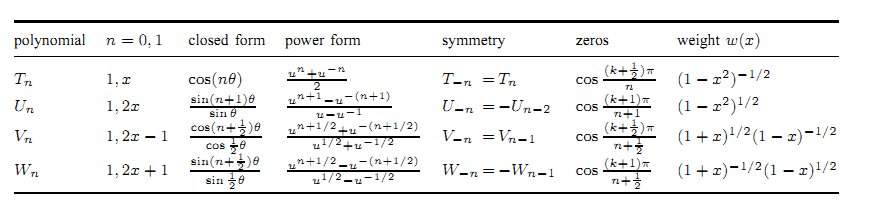

.. _Math_Algebra_polynomials_chebyshev:

Chebyshev polynomials
===================================

Cosines
-----------------

* We know that

  .. math::

    \cos(\alpha + \beta) = \cos\alpha \cos\beta - \sin \alpha \sin\beta
    
* Put :math:`\alpha = n\theta` and :math:`\beta = \theta`

  .. math::

    \cos((n+1)\theta) = \cos n\theta \cos\theta  - \sin n\theta \sin \theta
    
    
* Put :math:`\alpha = n\theta` and :math:`\beta = -\theta`

  .. math::

    \cos((n-1)\theta) = \cos n\theta \cos\theta  + \sin n\theta \sin \theta
    

* Adding

  .. math::
  
    \cos((n-1)\theta) + \cos((n+1)\theta) = 2\cos n\theta \cos\theta
    
    \cos((n+1)\theta) = 2\cos n\theta \cos\theta - \cos((n-1)\theta)
      
* We claim that for each non-negative integer :math:`n`, there exist 
  integers :math:`c_i` s.t.
  
  .. math::
  
    \cos n\theta = \sum_{i=0}^{n} c_i \cos^i (\theta)
      
      
Chebyshev polynomials
------------------------

* Essentially :math:`\cos n\theta` is a polynomial in :math:`\cos \theta`.

* For a fixed :math:`n` we define :math:`n^{th}` Chebyshev polynomial as:

  .. math::
  
    cos(n\theta) = T_n(cos\theta))
    
* Putting :math:`x = \cos\theta`, :math:`T_n(x)` is a polynomial.

  .. math::
  
    T_n(x) = \cos(n \arccos(x)) \quad  \forall x \in [-1,1]
    
    
* Basic Chebyshev polynomials:

  .. math::
  
    &T_0(x) = \cos 0 \theta = 1 \\
    &T_1(x) = \cos 1 \theta  = x 
    
* Recurrence relation:

  .. math::
   
    &T_{n-1}(x) + T_{n+1}(x) = 2 T_1(x) T_n(x) = 2x T_n(x)\\
    &T_{n+1}(x) =  2x T_n(x) - T_{n-1}(x)
    

  or 
  
  .. math::
  
    x T_n(x) = \frac{T_{n-1}(x) + T_{n+1}(x)}{2}
    
  This has resemblance to space shift operator in algebraic signal processing.
  
* Recurrence examples:

  .. math::
  
    &T_2(x) = 2x T_1(x) - T_0(x) = 2x^2 - 1\\
    &T_3(x) = 2 T_2(x) - T_1(x) = 2x(2x^2 -1) - x = 4x^3 - 3x
    
    
* Chebyshev polynomials upto 7th order

  .. math::    
    &T_0(x) = 1 \\
    &T_1(x) = x \\
    &T_2(x) = 2x^2 - 1\\
    &T_3(x) = 4x^3 - 3x\\
    &T_4(x) = 8x^4 - 8x^2 + 1\\
    &T_5(x) = 16x^5 - 20x^3 + 5x\\
    &T_6(x) = 32x^6 - 48x^4 + 18x^2 - 1\\
    &T_7(x) = 64x^7 - 112x^5 + 56x^3 -7x
    

.. image:: Chebyshev_Polynomials_of_the_1st_Kind_(n=0-5,_x=(-1,1)).*
    :align: center
    
    
Properties
---------------------

.. rubric:: Maximum value

.. math::

    \max_{-1\leq x \leq 1}T_n(x) = 1
    
    
.. rubric:: Composition

.. math::

    T_m(T_n(x)) = T_{mn}(x)
    

Proof:

.. math::

    \cos(m \arccos(\cos(n \arccos(x)))) = \cos(mn \arccos(x))
    

.. rubric:: Zeros

Zeros of :math:`T_n(x)` are given by:

.. math::

    x_k = \cos (\frac{(2k-1)\pi}{2n})\quad 1 \leq k \leq n
    
    
* All the roots of :math:`T_n(x)` are real and lie in the interval :math:`[-1,1]`.
    

.. rubric:: Recurrence

.. math::

        T_{n+1}(x) = 2xT_n(x) - T_{n-1}(x)
        
Thus:

.. math::

    T_{n}(x) = 2^{n-1}x^n  + \mathbb{O}(x^{n-1})
    
.. rubric:: Symmetry

* Lets compute :math:`T_{-1}(x)`.

  .. math::
  
    &T_1(x) = 2 xT_0(x) - T_{-1}(x) \\
    \implies &T_{-1}(x) =  2 xT_0(x) - T_1(x)\\
    &= 2x - x = x = T_1(x)

* It can be shown that:

  .. math::

    T_n(x) = T_{-n}(x) 
    
  The sequence of Chebyshev polynomials is symmetric.

Power form
----------------------

* Euler formula:

.. math::

    \cos \theta = \frac{e^{j\theta} + e^{-j\theta}}{2}
    
* Define :math:`u = e^{j\theta}`

  .. math::

    x = \cos \theta = \frac{u^{1} + u^{-1}}{2}
    
* Thus 

  .. math::
  
    T_n(x) = \cos n\theta = \frac{u^{n} + u^{-n}}{2}
    
    
  
Differential equation
---------------------------------

.. rubric:: Even/odd polynomials

.. math::

    T_n(-x) = (-1)^n T_n(x)
    
* Even degree Chebyshev polynomials are even functions.
* Odd degree Chevyshev polynomials are odd functions.

.. rubric:: Differential equation

* It can be shown that:

  .. math::

    (1-x^2)T''_n(x) - xT'_n(x) + n^2T_n(x) = 0
    

* Assume that :math:`y = \sum_{k=0}^{n}t_k x^k` is a solution to above
  differential equation. Then:

  .. math::

    (n^2 - k^2)t_k + (k+1)(k+2)t_{k+2} = 0
    

* We already know that :math:`t_n = 2^{n-1}`

* Solving further we get:

  .. math::

    t_{n-2m} = (-1)^m 2^{n - 2m -1} \frac{n}{n - m} {n -m \choose m}
    
    
Orthogonality
-----------------------

The integral

.. math::

        \int_0^{\pi} \cos (m\theta) \cos (n\theta) d\theta 

is zero unless :math:`m=n`.

If :math:`m=n`

* If :math:`m=n=0`, integral is :math:`\pi`.
* Otherwise, integral is :math:`\pi/2`

Putting :math:`x = \cos\theta`

.. math::

    \int_0^{\pi} \cos (m\theta) \cos (n\theta) d\theta  = \int_{-1}^{1} T_m(x) T_n(x) \frac{dx}{\sqrt{1-x^2}} 
        

* Chebyshev polynomials are orthogonal over :math:`[-1,1]` w.r.t. weight :math:`(1-x^2)^{-1/2}`

* The sequence :math:`\frac{1}{\pi}T_0, \frac{2}{\pi}T_1, \frac{2}{\pi}T_3,\dots` is an
  orthonormal system.

.. rubric:: Discrete orthogonality condition

* Let :math:`x_j` be roots of :math:`T_N`  

* The sum:

  .. math::
  
    \sum_{k=1}^{N} T(mx_k) T(nx_k)
    
  * Is zero if :math:`m \neq n`
  * :math:`N` if :math:`m=n=0`
  * :math:`N/2` otherwise

Chebyshev polynomials of different kinds
----------------------------------------------

* So far we have looked at Chebyshev polynomials of first kind.

* Chebyshev polynomials are generated by the recurrence relation:

  .. math::
  
    C_{n+1}(x) = 2xC_n(x) - C_{n-1}(x)
  
* :math:`C_0 = 1, C_1 = x` generates the Chebyshev polynomials of first kind
  denoted by :math:`T_n(x)`.
  
* Chebyshev polynomials of second, third and forth kind are described below.

  
        
References
---------------

* [CookChebyshevPolynomials]_

.. rubric:: Change log

:Last Modified:    $Id: chebyshev.rst 249 2012-08-05 06:17:57Z shailesh $
