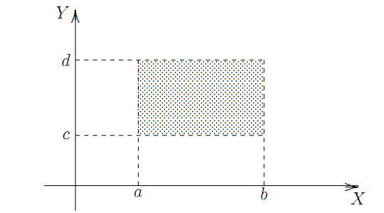
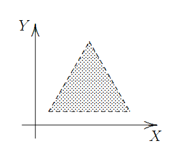
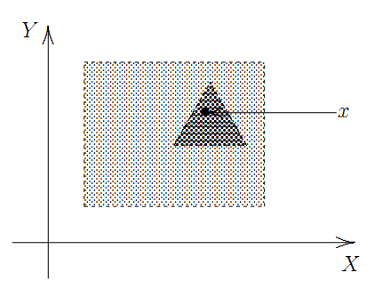
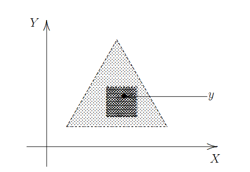

Euclidean Topology
============================

* Let :math:`\mathbb{R}` denote the set of all real numbers.

.. index:: euclidean topology on real line

.. topic:: Definition

    A subset :math:`S` of :math:`\mathbb{R}` is said to be open in
    the **euclidean topology on** :math:`\mathbb{R}` if it has the
    following property:
    
    (*) For each :math:`x \in S \quad \exists a,b \in \mathbb{R} \text{ and } a < b| x \in (a,b) \subseteq S`.
    
* When we refer to topological space :math:`\mathbb{R}` without specifying
  the topology, we mean :math:`\mathbb{R}` with euclidean topology.

* Every open interval :math:`(a,b)` is an open set.  

* The open intervals :math:`(r,\infty)` and :math:`(-\infty, r)` are open sets :math:`\forall r \in \mathbb{R}`.  
  
* While every open interval is an open set, not all open sets are intervals.

* For each :math:`c,d \in \mathbb{R}`, the closed interval :math:`[c,d]` is not
  an open set.
 

* For each :math:`a,b \in \mathbb{R}`, the closed interval :math:`[a,b]` is
  a closed set.
  
  
* Each singleton set :math:`\{a\}` is closed in :math:`\mathbb{R}`. Thus
  :math:`\mathbb{R}` is a :math:`T_1`-space.
  
* The set :math:`\mathbb{Z}` of all integers is a closed subset of :math:`\mathbb{R}`.

* The set :math:`\mathbb{Q}` of all rational numbers is neither a closed subset 
  nor an open subset of :math:`\mathbb{R}`.

.. topic:: Definition

    Let :math:`(X,\mathcal{T})` be a topological space. A subset :math:`S` of :math:`X` is
    said to be an :math:`F_{\sigma}` -set if it is the union of a countable number
    of closed sets. 
    
* All open intervals :math:`(a,b)` and all closed intervals :math:`[a,b]` are
  :math:`F_\sigma` -sets in :math:`\mathbb{R}`.

.. topic:: Definition

    Let :math:`(X,\mathcal{T})` be a topological space. A subset :math:`T` of :math:`X` is
    said to be an :math:`G_{\sigma}` -set if it is the intersection of a countable number
    of open sets. 
    
* All open intervals :math:`(a,b)` and all closed intervals :math:`[a,b]` are
  :math:`G_\sigma` -sets in :math:`\mathbb{R}`.

* :math:`\mathbb{Q}` is an :math:`F_{\sigma}` set in :math:`\mathbb{R}` but not
  a  :math:`G_{\sigma}` set.

Basis
----------------------

.. topic:: Proposition

    A subset :math:`S` of :math:`\mathbb{R}` is open if and only if 
    it is union of open intervals.
    
.. index:: basis;topology

.. topic:: Definition

    Let :math:`(X, \mathcal{T})` be a topological space. A collection
    :math:`\mathcal{B}` of open subsets of :math:`X` is said to
    be a **basis** for the topology :math:`\mathcal{T}` if every open
    set is a union of the members of :math:`\mathcal{B}`.

* :math:`\mathcal{B}` generates the topology :math:`\mathcal{T}` in the 
  following sense: if we are told what sets are members of :math:`\mathcal{B}`,
  then we can determine the members of :math:`\mathcal{T}`.   
  
.. rubric:: Example

* Let :math:`\mathcal{B} = \{(a,b) | a,b \in \mathbb{R}, a < b\}`. Then 
  :math:`\mathcal{B}` is a basis for the euclidean topology on :math:`\mathbb{R}`.
  

.. topic:: Remark

    If :math:`(X, \mathcal{T})`  is a topological space, then 
    :math:`\mathcal{B} = \mathcal{T}` is a basis for the topology 
    :math:`\mathcal{T}`.

* There can be many different bases for the same topology.
* If :math:`\mathcal{B}` is a basis for a topology :math:`\mathcal{T}` 
  on a set :math:`X` and :math:`\mathcal{B}_1` is a collection of
  subsets of :math:`X` such that 
  :math:`\mathcal{B} \subseteq \mathcal{B}_1 \subseteq \mathcal{T}`, then
  :math:`\mathcal{B}_1` is also a basis for :math:`\mathcal{T}`.
* Not any arbitrary collection of subsets of :math:`X` can generate a topology.

.. topic:: Proposition

    Let :math:`X` be a non-empty set and let :math:`\mathcal{B}` be
    a collection of subsets of :math:`X`. Then :math:`\mathcal{B}` is
    a basis for a topology on :math:`X` if and only if :math:`\mathcal{B}`
    has the following properties.
    
    #. :math:`X = \underset{B \in \mathcal{B}}{\cup} B`, and 
    #. for any :math:`B_1, B_2 \in \mathcal{B}`, the set
       :math:`B_1 \cap B_2` is a union of members of :math:`\mathcal{B}`.

* It is often easier to describing a topology by writing down its basis
  rather than describe all its open sets.
  
  
.. rubric:: Example

Let :math:`\mathcal{B}` be the collection of all "open rectangles"
:math:`\{\langle x,y\rangle: \langle x,y\rangle \in \mathbb{R}^2, a < x < b, c < y < d\}` 
in the plane which have each side parallel to the X- or Y-axis.

Then :math:`\mathcal{B}` is a basis for a topology on the plane. 

* This topology is the euclidean topology of :math:`\mathbb{R}^2`.
* :math:`\mathbb{R}^2` means the plane, and if we refer to 
  :math:`\mathbb{R}^2` as a topological space without explicitly 
  specifying the topology, we mean euclidean topology.
  
.. topic:: Remark

    Let :math:`\mathbb{R}^n = \{\langle x_1, x_2, \dots, x_n 
    \rangle : x_i \in \mathbb{R}, i = 1, \dots n \}`.
    Let :math:`\mathcal{B}` be the collection of all subsets 
    :math:`\{\langle x_1, x_2, \dots, x_n\rangle \in \mathbb{R}^n:
    a_i < x_i < b_i, i = 1,2,\dots, n\}` with sides parallel to the
    axes. This collection :math:`\mathcal{B}` is a basis for the
    **euclidean topology** on :math:`\mathbb{R}^n`.

.. index:: product topology
    
.. topic:: Remark

    Let :math:`\mathcal{B}_1` be a basis for a topology :math:`\mathcal{T}_1`
    on  a set :math:`X` and :math:`\mathcal{B}_2` be a basis for a topology 
    :math:`\mathcal{T}_2` on  a set :math:`Y`.  The set :math:`X\times Y`
    consists of all ordered pairs :math:`\langle x, y \rangle, x \in X, y \in Y`.
    Let :math:`\mathcal{B}` be the collection of subsets of :math:`X\times Y`
    consisting of all the sets :math:`B_1 \times B_2: B_1 \in \mathcal{B}_1, 
    B_2 \in \mathcal{B}_2`. Then :math:`\mathcal{B}` is a basis for a topology
    on :math:`X \times Y`. The topology so defined is called the
    **product topology** on :math:`X\times Y`.

Basis for a Given Topology
-----------------------------------------

Sometimes we are given a topology :math:`\mathcal{T}` on :math:`X` and
we want to verify whether :math:`\mathcal{B}` is a basis for this specific
topology :math:`\mathcal{T}`.

.. topic:: Proposition

    Let :math:`(X,\mathcal{T})` be a topological space. A family 
    :math:`\mathcal{B}` of open subsets of :math:`X` is a basis for
    :math:`\mathcal{T}` if and only if for any point 
    :math:`x \in U \text{ where } U \in \mathcal{T}`,
    there is a :math:`B \in \mathcal{B}` such that :math:`x \in B \subseteq U`.
    
    
.. topic:: Proposition

    Let :math:`\mathcal{B}` be a basis for a topology :math:`\mathcal{T}`
    on a set :math:`X`. Then a subset :math:`U \subseteq X` is open if
    and only if for each :math:`x \in U \exists 
    B \in \mathcal{B} | x \in B \subseteq U`.
    
    
How do we check whether two bases define the same topology?

.. topic:: Proposition

    Let :math:`\mathcal{B}_1` and :math:`\mathcal{B}_2` be bases for
    topologies :math:`\mathcal{T}_1` and :math:`\mathcal{T}_2`,
    respectively, on a non-empty set :math:`X`. Then 
    :math:`\mathcal{T}_1=\mathcal{T}_2` if and only if
    
    #. for each :math:`B \in \mathcal{B}_1` and each :math:`x \in B`,
       there exists a :math:`B' \in \mathcal{B}_2` such that
       :math:`x \in B' \subseteq B`, and       
    #. for each :math:`B \in \mathcal{B}_2` and each :math:`x \in B`,
       there exists a :math:`B' \in \mathcal{B}_1` such that
       :math:`x \in B' \subseteq B`.

.. rubric:: Example

* The set of all "open equilateral triangles" with base parallel to
  the X-axis is a basis for the euclidean topology on :math:`\mathbb{R}^2`.
  

* The set of all open disks forms a basis for the euclidean topology on :math:`\mathbb{R}^2`.