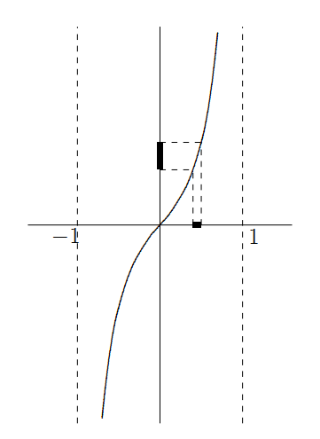

Homeomorphisms
============================

How do we identify that two topologies are equivalent?

Subspaces
-----------------------

.. index:: subspace;topology
.. index:: subspace topology
.. index:: relative topology
.. index:: induced topology

.. topic:: Definition

    Let :math:`Y` be a non-empty subset of a topological space :math:`(X, \mathcal{T})`. 
    The collection :math:`\mathcal{T}_Y = \{O \cap Y : O \in \mathcal{T}\}` 
    of subsets of :math:`Y`
    is a topology on :math:`Y` called the **subspace topology** (or the **relative topology**
    or the **induced topology**). The topological space :math:`(Y, \mathcal{T}_Y)` is
    called to be a **subspace** of :math:`(X,\mathcal{T})`.
    
.. rubric:: Example

* Let :math:`X = \{a, b, c, d, e, f\}`
* Let :math:`\mathcal{T} = \{X, \phi, \{a\}, \{c,d\}, \{a,c,d\}, \{b,c,d,e,f\} \}`
* And :math:`Y = \{b,c,e\}`
* Then the subspace topology on :math:`Y` is:

  .. math::
  
    \mathcal{T}_Y = \{Y, \phi, \{c\}\}
    
.. topic:: Remark

    Let :math:`\mathcal{B}` be a basis for the topology :math:`\mathcal{T}` on :math:`X`.
    Let :math:`Y` be a subset of :math:`X`.
    The the collection :math:`\mathcal{B}_Y = \{ B \cap Y : B \in \mathcal{B} \}` is
    a basis for the subspace topology :math:`\mathcal{T}_Y` on :math:`Y`.

.. rubric:: Example

* Consider the subset :math:`(1,2)` of :math:`\mathbb{R}`.
* A basis for the induced topology on :math:`(1,2)` is the collection
  :math:`\{(a,b) \cap (1,2) : a,b\in \mathbb{R}, a < b \}`; that is
  :math:`\{ (a,b) : a, b \in \mathbb{R} , 1 \leq a < b \leq 2 \}`.
  
.. rubric:: Example

* Consider the subset :math:`[1,2]` of :math:`\mathbb{R}`.
* A basis for the induced topology on :math:`[1,2]` is the collection
  :math:`\{(a,b) \cap [1,2] : a,b\in \mathbb{R}, a < b \}`; that is
  
  .. math::
  
    \{(a,b): 1 \leq a < b \leq 2 \} \cup \{[1,b) : 1 < b \leq 2\}
    \cup \{ (a,2] : 1 \leq a < 2\} \cup \{ [1,2] \}
    
    
* As we can see: some sets which are not open in :math:`\mathbb{R}` become
  open in the subspace topology.
  
.. rubric:: Example

* The topology induced on :math:`\mathbb{Z}` by the euclidean topology on :math:`\mathbb{R}`
  is the discrete topology.

* Going forward whenever we refer to :math:`(a,b), [a,b], [a,b), 
  (-\infty, a), (-\infty, a], (a,\infty), [a, \infty)` as topological spaces
  without explicitly stating the topology, we will mean the topology induced by
  the euclidean topology on :math:`\mathbb{R}`.
  
Homeomorphisms
-------------------------

.. rubric:: Example

* :math:`X = \{a,b,c,d,e\}`
* :math:`Y = \{g,h,i,j,k\}`
* :math:`\mathcal{T}_X = \{X,\phi, \{a\}, \{c,d\}, \{a,c,d\}, \{b,c,d,e\}\}`
* :math:`\mathcal{T}_Y = \{Y,\phi, \{g\}, \{i,j\}, \{g,i,j\}, \{h,i,j,k\}\}`
* Intuitively, the two topologies look equivalent. The function:
  
  .. math::
  
    &f : X \rightarrow Y \\
    &f(a) = g, f(b) = h, f(c) = i, f(d) = j, f(e) = k
    
  provides the equivalence.

.. index:: Homeomorphism
  
.. topic:: Definition

    Let :math:`(X, \mathcal{T}_1)` and :math:`(Y, \mathcal{T}_2)` be topological spaces.
    Then they are said to be **homeomorphic** if there exists a function 
    :math:`f : X \rightarrow Y` which has the following properties:
    
    #. :math:`f` is one-one. :math:`f(x_1) = f(x_2) \implies x_1 = x_2`.
    #. :math:`f` is onto. :math:`\forall y \in Y \exists x \in X | f(x) = y`.
    #. :math:`\forall U \in \mathcal{T}_2, \quad f^{-1} (U) \in \mathcal{T}_1`
    #. :math:`\forall V \in \mathcal{T}_1, \quad f(V) \in \mathcal{T}_2`
    
    Further the map :math:`f` is said to be **homeomorphism** 
    between :math:`(X, \mathcal{T}_1)` and :math:`(Y, \mathcal{T}_2)`.
    We write :math:`(X, \mathcal{T}_1) \cong (Y, \mathcal{T}_2)`.
    
    
* Homeomorphism is a reflexive, symmetric, and transitive relation. Hence it is
  an equivalence relation.
  
  
.. rubric:: Example

* Every non empty open interval :math:`(a,b)`  is homeomorphic to :math:`(0,1)`.

  .. math::
  
    f(x) = a(1-x) + bx 
  

* Every two non-empty open intervals :math:`(a,b)` and :math:`(c,d)` are
  homeomorphic.

* :math:`\mathbb{R}` is homeomorphic to :math:`(-1,1)`.

  .. math::
  
    f(x) = \frac{x}{1 - |x|}

* Thus every open interval :math:`(a,b)` is homeomorphic to :math:`\mathbb{R}`.

* It shows that length is not a topological property.

* Similarly any two closed intervals :math:`[a,b]` and :math:`[c,d]` are homeomorphic.
* Let :math:`a, b \in \mathbb{R}`, then:

 .. math::
 
    (-\infty,a] \cong (-\infty,b] \cong [a,\infty) \cong [b,\infty)
    
* With :math:`c,d,e,f \in \mathbb{R}` and :math:`c < d, e < f`, we have
  
  .. math::
  
    [c,d) \cong [e,f) \cong (c,d] \cong (e,f]

* :math:`\mathbb{Z} \cong \mathbb{N}`

* Any line in :math:`\mathbb{R}^2` given by :math:`X = \{\langle x, y \rangle : y = mx + c\}`
  is homeomorphic to :math:`\mathbb{R}`.
  
* Let :math:`X_1` and :math:`X_2` be the closed rectangular regions in :math:`\mathbb{R}^2`
  given by
  
  .. math::
  
    &X_1 = \{ \langle x,y \rangle : |x| \leq a_1 , |y| \leq b_1 \} \\
    &X_2 = \{ \langle x,y \rangle : |x| \leq a_2 , |y| \leq b_2 \}
 
  Then :math:`X_1 \cong X_2` w.r.t. their induced topologies
  
* Similarly any two closed discs in :math:`\mathbb{R}^2` are homeomorphic.

.. rubric:: Group of homeomorphisms

Let :math:`(X,\mathcal{T})` be any topological space and :math:`G` the
set of all homeomorphisms of :math:`X` into itself. Then :math:`G` is
a group under the operation of composition of functions.

Non-Homeomorphic Spaces
------------------------------------

Proving that two topological spaces are not homeomorphic is often much harder 
as we have to show that no homeomorphism exists.

.. rubric:: Example

We show that :math:`(X, \mathcal{T}_1) = [0,2]` is not homeomorphic to the subspace 
:math:`(Y, \mathcal{T}_2) = [0,1] \cup [2,3]`.

* :math:`[0,1]` and :math:`[2,3]` are clopen sets in :math:`(Y, \mathcal{T}_2)`
* Thus :math:`(Y, \mathcal{T}_2)` is not connected while :math:`(X, \mathcal{T}_1)`
  is connected.
* If :math:`X \cong Y`, w.r.t. a homeomorphism 
  :math:`f: (X, \mathcal{T}_1) \rightarrow (Y, \mathcal{T}_2)` 
  then there exists a clopen set :math:`f^{-1}([0,1]) \in X`, a contradiction.
* Hence :math:`X \ncong Y`.

.. topic:: Proposition

    Any topological space homeomorphic to a connected space is connected.

.. rubric:: Properties preserved by homeomorphisms

Let :math:`X \cong Y`, w.r.t. a homeomorphism :math:`f: (X, \mathcal{T}_1) 
\rightarrow (Y, \mathcal{T}_2)` 

#. If one is a :math:`T_0`-space, so is the other.
#. If one is a :math:`T_1`-space, so is the other.
#. If one is a :math:`T_2`-space or Hausdorff space, so is the other.
#. If one is a regular space, so is the other.
#. If one is a :math:`T_3`-space, so is the other.
#. If one satisfies second axiom of countability, so does the other.
#. If one is a separable space, so is the other.
#. If one is connected, so is the other.
#. If one is a discrete space, so is the other.
#. If one is an indiscrete space, so is the other.
#. If one is a finite-closed topology, so is the other.
#. If one is a countable-closed topology, so is the other.
#. If one is countable so is the other.
#. If one is uncountable, so is the other.
#. If one is finite, so is the other with same cardinality.

We use above properties to verify if two topologies are homeomorphic or not.

.. topic:: Definition

    A subset :math:`S` of :math:`\mathbb{R}` is said to be an **interval** 
    if it has the following property: if :math:`x \in S, z \in S`, and
    :math:`y \in \mathbb{R}` are such that :math:`x < y < z`, then :math:`y \in S`.
 
 
 .. topic:: Proposition
 
    A subspace :math:`S` of :math:`\mathbb{R}` is connected if and only if it
    is an interval.
    
How is :math:`(0,1) \ncong [0,1]`?

    
.. topic:: Remark

    Let :math:`f : (X, \mathcal{T}_1) \rightarrow (Y, \mathcal{T}_2)`
    be a homeomorphism.
    Let :math:`a \in X` so that :math:`X \setminus \{a\}` be a subspace
    of :math:`X` with an induced topology :math:`\mathcal{T}_3`. Also
    :math:`Y \setminus \{f(a)\}` is a subspace of :math:`Y` with an
    induced topology :math:`\mathcal{T}_4`.  Then 
    
    .. math::
    
        (X\setminus \{a\}, \mathcal{T}_3) \cong (Y\setminus \{f(a)\}, \mathcal{T}_4)
    
* Removing any element from an open interval makes it disconnected.
* Removing the border element from a closed / semi-closed interval leaves it connected.

.. topic:: Corollary

    If :math:`a,b,c,d` are real numbers with :math:`a < b` and :math:`c < d`, then
    
    #. :math:`(a,b) \ncong [c,d)`
    #. :math:`(a,b) \ncong [c,d]` and
    #. :math:`[a,b) \ncong [c,d]`
    
.. index:: topological property

.. topic:: Definition

    A property is said to be **topological** if it is preserved by homeomorphisms.
    