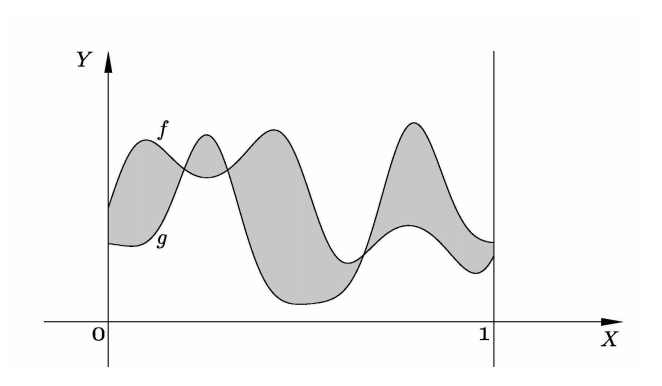
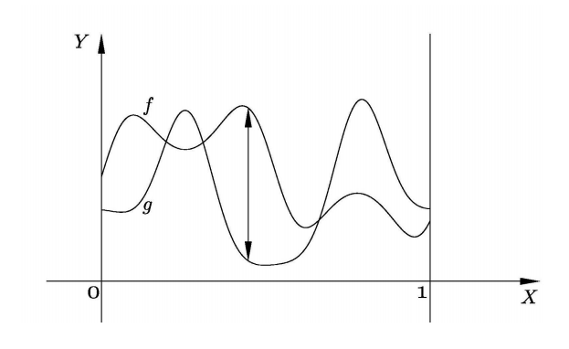
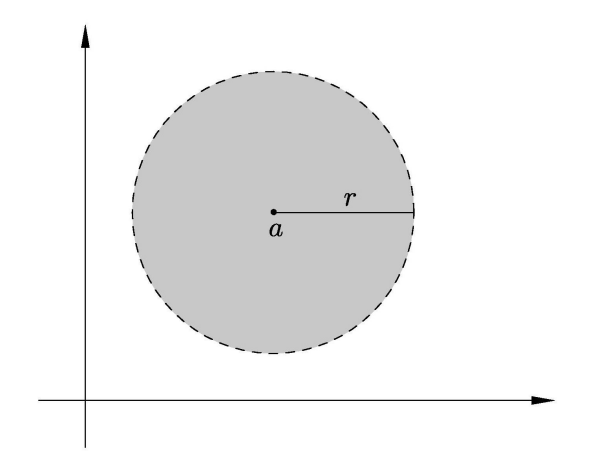
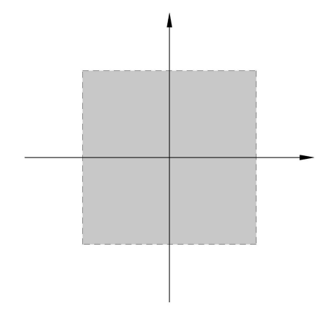
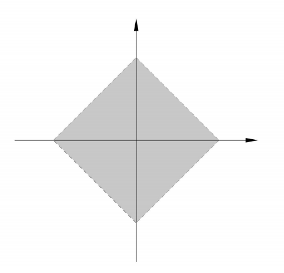

Metric Spaces
========================

* Most important class of topological spaces
* Provide a rich source of examples
* Most applications of topology to analysis are via metric spaces

Metric Spaces
-------------------------

.. index:: metric
.. index:: metric space
.. index:: distance

.. topic:: Definition

    Let :math:`X` be a non-empty set and :math:`d` a real-valued function
    defined on :math:`X \times X` such that for :math:`a,b \in X`:
    
    #. :math:`d(a,b) \geq 0` and :math:`d(a,b) = 0  \iff a = b`;
    #. :math:`d(a,b) = d(b,a)`; and
    #. :math:`d(a,c) \leq d(a,b) + d(b,c)`, [the triangle inequality] 
       :math:`\forall a,b,c \in X`.
       
    Then :math:`d` is said to be a **metric** on :math:`X`, :math:`(X,d)`
    is called a **metric space** and :math:`d(a,b)` is referred to
    as the **distance** between :math:`a` and :math:`b`.
    
.. rubric:: Example

* The function :math:`d: \mathbb{R} \times \mathbb{R} \mapsto \mathbb{R}` given by
  
  .. math::
  
    d(a,b) = |a-b|, \quad a,b \in \mathbb{R}
    
  is a metric on the set :math:`\mathbb{R}` known as the **euclidean metric**.
  
  
* The function :math:`d : \mathbb{R}^2 \times \mathbb{R}^2 \mapsto \mathbb{R}` given by

  .. math::
  
    d( \langle a_1, b_1 \rangle, \langle a_2,b_2 \rangle ) = \sqrt{
    (a_1 - b_1)^2 + (a_2 - b_2)^2}
    
  is a metric on :math:`\mathbb{R}^2`.
  
* Let :math:`X` be a non-empty set and :math:`d` the function from :math:`X\times X`
  into :math:`\mathbb{R}` defined by 
  
  .. index:: discrete metric
  
  .. math::
    
    d(a,b) = \left\{
        \begin{array}{ll}
        0 & \mbox{if $a = b$}\\
        1 & \mbox{if $a \neq b$}
        \end{array}
        \right.
  
  
  Then :math:`d` is a metric on :math:`X` and is called the **discrete metric**.
  
Function Spaces
''''''''''''''''''''''''
  
* Let :math:`C[0,1]` denote the set of continuous functions from :math:`[0,1]`
  into :math:`\mathbb{R}`. A metric is defined on this set by
  
  .. math::
  
    d(f,g) = \int_0^1 |f(x) - g(x)| dx
    
  where :math:`f,g` are in :math:`C[0,1]`.
  
  
  

* :math:`d(f,g)` is precisely the area of the region which lies between the graphs
  of functions.
  
* Now, Another metric is defined on :math:`C[0,1]` as follows:

  .. math::
  
    d^*(f,g) = \text{sup}\{|f(x) - g(x)| : x \in [0,1] \}

* Clearly :math:`d^*(f,g)` is just the largest vertical gap between the graphs
  of functions :math:`f` and :math:`g`.
  
  
* More metrics on :math:`\mathbb{R}^2`:

  .. math::
  
    &d( \langle a_1, b_1 \rangle, \langle a_2,b_2 \rangle )
        = \max\{ |a_1  - b_1 | , | a_2 - b_2 | \}\\
    &d( \langle a_1, b_1 \rangle, \langle a_2,b_2 \rangle )
        = |a_1  - b_1 | + | a_2 - b_2 |

        
Normed vector spaces
'''''''''''''''''''''''''''''''''

Let :math:`V` be a vector space over the field of real or complex numbers.
A **norm** :math:`\parallel \text{  } \parallel` on :math:`V` is a map 
:math:`V \mapsto \mathbb{R}` such that for all :math:`a,b \in V` and 
:math:`\alpha` in the field:

#. :math:`\parallel a \parallel \geq 0` and :math:`\parallel a \parallel = 0 \iff a = 0`,
#. :math:`\parallel a + b \parallel \leq \parallel a \parallel + \parallel b \parallel`, and
#. :math:`\parallel \alpha a \parallel = |\alpha | \parallel a \parallel`.

A **normed vector space** is a vector space with a norm.

* Let :math:`(V, \parallel \parallel)` be any normed vector space. 
  Then there is a corresponding metric, :math:`d`, on the set :math:`V`
  given by :math:`d(a,b) = \parallel a - b \parallel \quad \forall a,b \in V`.
  
  
Metric Spaces as Topological Spaces
----------------------------------------------

.. rubric:: Open balls

In a normed vector space, the **open ball with center a and radius r** is
defined to be the set

.. math::

    B_r(a) = \{x : x \in V | \parallel x - a \parallel < r\}
    
Why not generalize?

.. topic:: Definition

    Let :math:`(X,d)` be a metric space and :math:`r` any positive real
    number. Then the **open ball** about :math:`a \in X` of radius :math:`r`
    is the set
    
    .. math::
    
        B_r(a) = \{x : x \in X  |  d(a,x) < r\}
        
        
.. topic:: Example

    The shape of the open ball depends on the choice of metric.

.. centered:: :math:`\mathbb{R}^2` with euclidean metric

.. centered:: :math:`d^*( \langle a_1, b_1 \rangle, \langle a_2,b_2 \rangle )
        = \max\{ |a_1  - b_1 | , | a_2 - b_2 | \}`

.. centered:: :math:`d_1( \langle a_1, b_1 \rangle, \langle a_2,b_2 \rangle )
        = |a_1  - b_1 | + | a_2 - b_2 |`

What happens in the intersection of open balls? 
        
.. topic:: Lemma

    Let :math:`(X,d)` be a metric space and :math:`a` and :math:`b` points
    of :math:`X`. Further let :math:`\delta_1` and :math:`\delta_2` be
    positive real numbers. If :math:`c \in B_{\delta_1}(a) \cap B_{\delta_2}(b)`,
    then there exists a :math:`\delta > 0` such that 
    :math:`B_{\delta}(c) \subseteq B_{\delta_1}(a) \cap B_{\delta_2}(b)`

Do open balls look like open sets? 
    
.. topic:: Corollary

    Let :math:`(X,d)` be a metric space and :math:`B_1` and :math:`B_2` 
    open balls in :math:`(X, d)`. then :math:`B_1 \cap B_2` is union
    of open balls in :math:`(X,d)`.
    
So we do have a basis!

.. topic:: Proposition

    Let :math:`(X,d)` be a metric space. Then the collection of
    open balls in :math:`(X,d)` is a basis for a topology :math:`\mathcal{T}`
    on :math:`X`.
    
* :math:`\mathcal{T}` is referred to as **the topology induced by metric d**.

.. index:: induced topological space
.. index:: corresponding topological space
.. index:: associated topological space

* :math:`(X, \mathcal{T})` is called the **induced topological space** or
  the **corresponding topological space** or the **associated topological space**.

    
.. rubric:: Example

* If :math:`d` is the discrete metric on a set :math:`X`, then for
  each :math:`x \in X, B_{\frac{1}{2}}(x) = \{x\}`. So all
  singleton sets are open in topology :math:`\mathcal{T}`
  induced on :math:`X`  by :math:`d`. Thus :math:`\mathcal{T}`
  is the discrete topology.
  
  

* The euclidean metric on :math:`\mathbb{R}` induces the euclidean topology 
  on :math:`\mathbb{R}`. Ditto for :math:`\mathbb{R}^2`.
* But the other metrics :math:`d^*` and :math:`d_1` also induce
  euclidean topology on :math:`\mathbb{R}^2`.

Different metrics can induce same topology!

.. index:: equivalent metrics

.. topic:: Definition

    Metrics on a set :math:`X` are said to be **equivalent** if they
    induce the same topology on :math:`X`.
    
So whats the relation between open balls and open sets?

.. topic:: Proposition 

    Let :math:`(X, d)` be a metric space and :math:`\mathcal{T}`
    the topology induced on :math:`X` by the metric :math:`d`.
    Then a subset :math:`U` of :math:`X` is open in 
    :math:`(X, \mathcal{T})` if and only if for each
    :math:`x \in U` there exists an :math:`\epsilon > 0`
    such that the open ball :math:`B_{\epsilon}(a) \subseteq U`
    
Is every topology induced by a metric?

Metrizable Spaces
''''''''''''''''''''''''''''

.. index:: hausdorff space

.. topic:: Definition

    A topological space :math:`(X, \mathcal{T})` is said to
    be a **Hausdorff space** or a :math:`T_2`-space if
    for each pair of distinct points :math:`a` and :math:`b`
    in :math:`X`, there exist open sets :math:`U` and :math:`V`
    such that :math:`a\in U, b\in V`, and :math:`U\cap V = \phi`.

.. topic:: Proposition

    Let :math:`(X, d)` be any metric space and :math:`\mathcal{T}`
    the topology induced on :math:`X` by :math:`d`. Then :math:`(X, \mathcal{T})`
    is a Hausdorff space.
    
* Any set with 2 or more elements which has the indiscrete topology
  is not a Hausdorff space.
* :math:`\mathbb{Z}` with finite closed topology is not a Hausdorff space.

.. index:: metrizable

.. topic:: Definition

    A space :math:`(X, \mathcal{T})` is said to be **metrizable** if
    there exists a metric :math:`d` on the set :math:`X` with the
    property that :math:`\mathcal{T}` is the topology induced by
    :math:`d`.
    
.. warning::

    Every Hausdorff space is not metrizable. Though every metrizable space
    is a Hausdorff space.

* Every subspace of a metrizable space is metrizable.

Bounded Metrics
'''''''''''''''''''''''''''

.. index:: bounded metric

.. topic:: Definition    

    A metric space :math:`(X, d)` is said to be **bounded**, and
    :math:`d` is said to be a **bounded metric** if there
    exists a positive real number :math:`M` such that 
    :math:`d(x,y) < M`, for all :math:`x,y \in X`.
    
* Every metric is equivalent to a bounded metric.

l_p spaces
'''''''''''''''''''''

* Let :math:`l_1` be the set of all sequences of real numbers

  .. math::
  
    x = (x_1,x_2, \dots, x_n, \dots)
    
  with the property that the series :math:`\sum_{n=1}^{\infty}|x_n|` is 
  convergent. If we define
  
  .. math::
  
    d_1(x,y) = \sum_{n=1}^{\infty}|x_n - y_n|  \quad \forall x, y \in l_1
    
  Then :math:`(l_1, d_1)` is a metric space.
 
* Let :math:`l_2` be the set of all sequences of real numbers

  .. math::
  
    x = (x_1,x_2, \dots, x_n, \dots)
    
  with the property that the series :math:`\sum_{n=1}^{\infty}x_n^2` is 
  convergent. If we define
  
  .. math::
  
    d_2(x,y) = (\sum_{n=1}^{\infty}|x_n - y_n|^2)^{\frac{1}{2}}  \quad \forall x, y \in l_2
    
  Then :math:`(l_2, d_2)` is a metric space.

* Let :math:`l_{\infty}` be the set of bounded sequences of real numbers
  :math:`x = (x_1,x_2, \dots, x_n, \dots)`. If we define
  
  .. math::
  
    d_{\infty}(x,y) = \sup\{|x_n - y_n| : n \in \mathbb{N} \}  
    \quad \forall x, y \in l_{\infty}
    
  Then :math:`(l_{\infty}, d_{\infty})` is a metric space.
  
* Each of the above spaces is a normed vector space in a natural way.

Normal Space
''''''''''''''''''''''

.. index:: normal space; topology

.. topic:: Definition

    A topological space :math:`(X, \mathcal{T})` is said to be
    a **normal space** if for each pair of disjoint closed
    sets :math:`A` and :math:`B`, there exist open sets
    :math:`U` and :math:`V` such that :math:`A\subseteq U, B \subseteq V`
    and :math:`U\cap V = \phi`.
    
* Every metrizable space is a normal space.

.. index:: isometric space
.. index:: isometry

.. topic:: Definition

    Let :math:`(X,d_1)` and :math:`(Y, d_2)` be metric spaces. 
    Then :math:`(X,d_1)` is said to be **isometric** to
    :math:`(Y,d_2)` if there exists a surjective mapping 
    :math:`f : (X,d_1) \mapsto (Y,d_2)` such that for all
    :math:`x_1, x_2 \in X`
    
    .. math::
    
        d_1(x_1, x_2) = d_2(f(x_1), f(x_2))
        
    Such a mapping is called **isometry**.
    
* Every isometry is a homeomorphism of the corresponding topological spaces.

Locally Euclidean
''''''''''''''''''''''''''''''

.. index:: locally euclidean

.. topic:: Definition

    A topological space :math:`(X, \mathcal{T})` is said to be 
    **locally euclidean** if there exists a positive integer
    :math:`n` such that each point :math:`x \in X` has
    an open neighborhood homeomorphic to an open ball about
    :math:`0 \in \mathbb{R}^n` with the euclidean metric. 
    
* Every non-trivial interval :math:`(a,b) \in \mathbb{R}` is locally euclidean.
* The unit circle in complex plane is locally euclidean.
* Every topological space homeomorphic to :math:`\mathbb{R}^n` is locally
  euclidean.
  
  
Manifold
'''''''''''''''''''''''

  
.. index:: topological manifold

.. topic:: Definition

    A Hausdorff locally euclidean space is said to be a 
    **topological manifold**.
    
There are many different kinds of manifolds (when more structure is imposed).

* Differentiable manifolds
* Smooth manifolds 
* Riemannian manifolds
* Cauchy-Riemannian manifolds (CR-manifolds)

    
Convergence of Sequences
---------------------------------------------------------
.. index:: convergence; topology

.. topic:: Definition

    Let :math:`(X,d)` be a metric space and  :math:`x_1, \dots, x_n, \dots` a sequence
    of points in :math:`X`. Then the sequence is said to **converge to** :math:`x \in X`
    if given any :math:`\epsilon > 0`, there exists an integer :math:`n_0` such that
    for all :math:`n > n_0, d(x,x_n) < \epsilon`.
    This is denoted by :math:`x_n \to x`.
    
    The sequence :math:`y_1, y_2, \dots, y_n, \dots` of points in 
    :math:`(X, \mathcal{T})` is said to be **convergent** if there
    exists a point :math:`y \in X` such that :math:`y_n \to y`.

Convergence is unique!

.. topic:: Proposition

    Let :math:`x_1, x_2, \dots, x_n, \dots` be a sequence of points
    in a metric space :math:`(X, d)`. Further, let :math:`x` and 
    :math:`y` be points in :math:`(X,d)` such that :math:`x_n \to x`
    and :math:`x_n \to y`. Then :math:`x = y`.
    
Convergence describes topology!

.. topic:: Proposition

    Let :math:`(X,d)` be a metric space. A subset :math:`A` of
    :math:`X` is closed in :math:`(X,d)` if and only if
    every convergent sequence of points in :math:`A` converges
    to a point in :math:`A`. 
    
    (In other words, :math:`A` is
    closed in :math:`(X,d)` if and only if :math:`a_n \to x`, where
    :math:`x \in X` and :math:`a_n \in A` for all :math:`n`, implies :math:`x \in A`.)
    
    
Naturally convergence also describes continuous functions!

.. topic:: Proposition

    Let :math:`(X,d)` and :math:`(Y,d_1)` be metric spaces and :math:`f` a mapping
    of :math:`X` into :math:`Y`. Let :math:`\mathbf{\tau}` and 
    :math:`\mathbf{\tau}_1` be the topologies determined by :math:`d` and
    :math:`d_1`, respectively. Then 
    :math:`f : (X, \mathbf{\tau})\mapsto (Y, \mathbf{\tau}_1)` is
    continuous if and only if :math:`x_n \to x \implies f(x_n) \to f(x);`
    i.e., if :math:`x_1, x_2,\dots, x_n, \dots` is a sequence of points
    in :math:`(X,d)` converging to :math:`x`, then the sequence of
    points :math:`f(x_1), f(x_2),\dots, f(x_n), \dots` in :math:`(Y, d_1)`
    converges to :math:`f(x)`.

.. topic:: Corollary

    :math:`f : (X, \mathbf{\tau})\mapsto (Y, \mathbf{\tau}_1)` (as above) is
    continuous if and only if for each :math:`x_0 \in X` and :math:`\epsilon > 0`,
    there exists a :math:`\delta > 0` such that :math:`x \in X` and
    :math:`d(x,x_0) < \delta \implies d_1(f(x), f(x_0)) < \epsilon`.

.. rubric:: distance between sets

.. index:: distance between sets

.. topic:: Definition

    Let A and B be non-empty sets in a metric space :math:`(X,d)`.
    Define

    .. math::
  
        \rho(A,B) = \inf\{d(a,b) : a \in A, b \in B\}
    
    Then :math:`\rho(A,B)` is referred to as the 
    **distance between sets A and B**.
   
    
Completeness
-----------------------------

.. index:: Cauchy sequence

.. topic:: Definition

    A sequence :math:`x_1, x_2, \dots, x_n, \dots` of points
    in a metric space :math:`(X,d)` is said to be a 
    **Cauchy sequence** if given any real number :math:`\epsilon  > 0`,
    there exists a positive number :math:`n_0`, such that for all
    integers :math:`m > n_0, n > n_0`, we have :math:`d(x_m, x_n) < \epsilon`.
    
    
Every convergent sequence is a Cauchy sequence.

.. topic:: Proposition

    Let :math:`(X,d)` be a metric space and :math:`x_1, x_2, \dots, x_n \dots`
    a sequence of points in :math:`(X,d)`. If there exists a point
    :math:`a \in X`, such that the sequence converges to :math:`a`, 
    i.e. :math:`x_n \to a`, then the sequence is a Cauchy sequence.
    
But every Cauchy sequence need not be convergent.

.. rubric:: Example

* Consider the open interval :math:`(0,1)` with the euclidean metric :math:`d`.
* It is clear that the sequence :math:`0.1, 0.01, 0.001, 0.0001, \dots` is
  a Cauchy sequence but it does not converge to any point in :math:`(0,1)`.

.. index:: complete metric space

.. topic:: Definition

    A metric space is called to be **complete** if every Cauchy sequence 
    in :math:`(X,d)` converges to a point in :math:`(X,d)`.
    
    
* Thus we see that :math:`(0,1)` with the euclidean metric is not a 
  complete metric space.
  
* If :math:`X` is any finite set and :math:`d` is the discrete metric
  on :math:`X`, then :math:`(X,d)` is a complete metric space.
  
* :math:`\mathbb{R}` with the euclidean metric is a complete metric space. How?
* We will denote :math:`x_1, x_2, \dots, x_n \dots` by :math:`\{x_n\}`. 

.. index:: subsequence

.. topic:: Definition

    If :math:`\{x_n\}` is any sequence, then the sequence 
    :math:`\{x_{n_1}, x_{n_2}, \dots\}` is said to be a **subsequence**
    if :math:`n_1 < n_2 < n_3 < \dots`.
    
.. index::  increasing sequence
.. index::  decreasing sequence
.. index::  monotonic sequence

.. topic:: Definitions

    Let :math:`\{x_n\}` be a sequence in :math:`\mathbb{R}`. Then it is
    said to be an **increasing sequence**  if :math:`x_n \leq x_{n+1} \quad\forall n \in \mathbb{N}`. 
    
    It is said to be a **decreasing sequence** 
    if :math:`x_n \geq x_{n+1} \quad\forall n \in \mathbb{N}`.

    A sequence which is either increasing or decreasing is said to be
    a **monotonic sequence**.
    
* Most sequences off course are neither increasing nor decreasing.

.. index:: peak point

.. topic:: Definition

    Let :math:`\{x_n\}` be a sequence in :math:`\mathbb{R}`.  Then
    :math:`n_0 \in \mathbb{N}` is said to be a **peak point** if 
    :math:`x_n \leq x_{n_0} \quad \forall n \geq n_0`.
    
.. topic:: Lemma

    Let :math:`\{x_n\}` be a sequence in :math:`\mathbb{R}`. Then 
    :math:`\{x_n\}` has a monotonic subsequence.
    
* If :math:`\{x_n\}` has infinite number of peak points, then the
  subsequence of peak points is a decreasing subsequence.
  
* Otherwise there exists an integer :math:`N` such that there are
  no peak points for :math:`n > N`. Choose any :math:`n_1 > N`. 
  We can find :math:`n_2 > n_1 | x_{n_2} > x_{n_1}` since :math:`n_1`
  is not a peak point. Similarly we can find :math:`n_3 > n_2`.  
  This way we can find an increasing sequence (by mathematical induction).
  
.. topic:: Proposition

    Let :math:`\{x_n\}` be a monotonic sequence in :math:`\mathbb{R}`
    with the euclidean metric. Then :math:`\{x_n\}` converges to
    a point in :math:`\mathbb{R}` if and only if :math:`\{x_n\}` 
    is bounded.
    
* If :math:`\{x_n\}` is unbounded, then naturally it doesn't converge.
* Assuming :math:`\{x_n\}` as an increasing bounded sequence,
  there is a least upper bound :math:`L` of the the set
  :math:`\{x_n\}, n \in \mathbb{N}`.
* Thus :math:`\forall \epsilon > 0, \exists N > 0 | d(x_N, L) < \epsilon`
* Since :math:`\{x_n\}` is increasing, hence we have

  .. math::
  
    L - \epsilon < x_n < L \quad \forall n > N.

.. index:: Bolzano-Weierstrass Theorem
    
.. topic:: (Bolzano-Weierstrass Theorem)

    Every bounded sequence in :math:`\mathbb{R}` with 
    euclidean metric has a convergent subsequence.

.. topic:: Corollary

    The metric space :math:`\mathbb{R}` with the euclidean metric is a
    complete metric space.
    
* We have to show that every Cauchy sequence converges in :math:`\mathbb{R}`.
* :math:`\exists N > 0 | \forall m, n \geq N, d(x_n, x_m) < 1`.
* :math:`M  = |x_1| + |x_2| + \dots + |x_N| + 1` is an upper bound. Hence  
  :math:`\{x_n\}` is bounded, hence has a convergent subsequence
  :math:`\{x_{n_k}\}` with :math:`x_{n_k} \to a`.
* Choose :math:`\epsilon > 0`. Then :math:`\exists N_0 > 0` such that
  
  .. math::
  
    |x_n - x_m| < \frac{\epsilon}{2}\quad \forall m,n \geq N_0.
    
    
* Also :math:`\exists N_1 > 0` such that

  .. math::
  
    |x_{n_k} - a| < \frac{\epsilon}{2}\quad \forall n_k \geq N_1.
    
* Choose :math:`N  = \max(N_0, N_1)`. Then 

  .. math::
  
    |x_n - a| < \epsilon\quad \forall  n \geq N.
    
.. topic:: Corollary 

    For each positive integer :math:`m`, the metric space
    :math:`\mathbb{R}^m` with the euclidean metric is a complete
    metric space.
    
* A normed vector space which is complete is called a **Banach space**.
* An inner product space which is complete is called a **Hilbert space**.
* The space :math:`C[a,b]` of continuous real valued functions on a 
  closed and bounded interval is a Banach space, and so is a complete
  metric space w.r.t. the supremum norm. 
  
Completeness and subspaces
''''''''''''''''''''''''''''''''''''''
    
.. topic:: Proposition

    Let :math:`(X,d)` be a metric space, :math:`Y` a subset of
    :math:`X`, and :math:`d_1` the metric induced on :math:`Y`
    by :math:`d`.
    
    #. If :math:`(X,d)` is a complete metric space and :math:`Y`
       is a closed subspace of :math:`(X,d)`, then :math:`(Y,d_1)`
       is a complete metric space.
   
    #. If :math:`(Y,d_1)` is a complete metric space, then :math:`Y`
       is a closed subspace of :math:`(X,d)`.
       
* :math:`(0,1)` is not complete while :math:`[0,1]` is complete.
* :math:`(0,1)` is homeomorphic to :math:`\mathbb{R}`. But 
  :math:`\mathbb{R}` is complete while :math:`(0,1)` is not. Hence
  completeness is not a topological property (preserved by homeomorphism).
  
.. index:: completely metrizable
  
.. topic:: Definition

    A topological space :math:`(X, \mathcal{T})` is said to be **completely metrizable** 
    if there exists a metric :math:`d` on :math:`X` such that
    :math:`\mathcal{T}` is the topology on :math:`X` determined by :math:`d` and
    :math:`(X,d)` is a complete metric space.
    
* Being completely metrizable is a topological property.
* The topological spaces :math:`\mathbb{R}`, :math:`[a,b], (a,b), [a,b), (a,b]`,
  :math:`(-\infty, a), (-\infty, a], (a, \infty), [a, \infty)` and :math:`\{a\}`
  are all completely metrizable.
* The space :math:`\mathbb{P}` of irrational numbers with the induced topology
  is completely metrizable.

.. topic:: Definition

   A topological space is said to be **separable** if it has a countable dense
   subset.
   
.. index:: polish space

.. topic:: Definition

    A topological space is called **Polish space** if it is separable and
    completely metrizable.
    
* :math:`\mathbb{R}` is a polish space, so is :math:`\mathbb{R}^n`.

.. index:: souslin space
.. index:: analytical set

.. topic:: Definition

    A topological space :math:`(X,\mathcal{T})` is said to be a 
    **Souslin space** if it is Hausdorff and a continuous image
    of a Polish space. If :math:`A` is a subset of a topological
    space :math:`(Y, \mathcal{T}_1)` such that with the induced
    topology, the space :math:`(A, \mathcal{T}_2)` is a 
    Souslin space, then :math:`A` is said to be an **analytical set**
    in :math:`(Y, \mathcal{T}_1)`.
    
* Every Polish space is a Souslin space  since its a continuous image of itself 
  and is a Hausdorff space (being a metric space).
  
* Every Souslin space need not be metrizable.

* Even a metrizable Souslin space is not necessarily a Polish space.

* Analytic subsets of Polish spaces are closed under countable unions 
  and intersections.
* If the complement of an analytic set is analytic then the set is Borel.
* Analytic sets are always Lebesgue measurable. 
* Topology > Metric Spaces > Measure Theory > Probability Theory

Metric space equivalence
''''''''''''''''''''''''''''''

* Two topological spaces are equivalent if they are homeomorphic.
* When are two metric spaces equivalent (as metric spaces)?

.. index:: isometric

.. topic:: Definition

    Let :math:`(X,d)` and :math:`(Y,d_1)` be metric spaces. Then
    :math:`(X,d)` is said to be **isometric** to :math:`(Y,d_1)`
    if there exists a surjective mapping :math:`f : X \mapsto Y`
    such that :math:`\forall x_1, x_2 \in X, d(x_1, x_2) = d_1(f(x_1), f(x_2))`.
    Such a mapping is said to be an **isometry**.
    
* The associated topological spaces of two isometric spaces are homeomorphic.

.. index:: isometric embedding

.. topic:: Definition

    Let :math:`(X,d)` and :math:`(Y,d_1)` be metric spaces and
    :math:`f` a mapping of :math:`X` into :math:`Y`. Let :math:`Z = f(X)`,
    and :math:`d_2` be the metric induced on :math:`Z` by :math:`d_1`. 
    If :math:`f:(X,d) \mapsto (Z, d_1)` is an isometry, then :math:`f` is
    said to be an **isometric embedding** of :math:`(X,d)` in :math:`(Y,d_1)`.
    
    
* Natural embedding of :math:`\mathbb{Q}` with euclidean metric in
  :math:`\mathbb{R}` with euclidean metric is an isometric embedding.

Completion  
''''''''''''''''''''''''''''
  
.. index:: completion of metric space
  
.. topic:: Definition

    Let :math:`(X,d)` and :math:`(Y,d_1)` be metric spaces and
    :math:`f` a mapping of :math:`X` into :math:`Y`. If :math:`(Y,d_1)`
    is a complete metric space, :math:`f` is an isometric embedding
    and :math:`f(X)` is a dense subset of :math:`Y` in the associated
    topological space, then :math:`(Y,d_1)` is said to be a 
    **completion** of :math:`(X,d)`.
    
* :math:`\mathbb{R}` is a completion of :math:`\mathbb{Q}` and :math:`\mathbb{P}`.
* Does every metric space has a completion?
* Is the completion of a metric space unique in some sense?

.. topic:: Proposition

    Let :math:`(X,d)` be a metric space. Then :math:`(X,d)` has a completion.
    
    
* Two Cauchy sequences :math:`\{y_n\}` and :math:`\{z_n\}` are equivalent if
  :math:`d(x_n, y_n) \to 0` in :math:`\mathbb{R}`.
* This is an equivalence relation.
* Let :math:`\widetilde{X}` be the set of all equivalence classes of Cauchy sequences.
* Let :math:`\tilde{y}` and :math:`\tilde{z}` be two points in :math:`\widetilde{X}`.
* Let :math:`\{y_n\} \in \tilde{y}` and :math:`\{z_n\} \in \tilde{z}`.
* The sequence :math:`d(y_n, z_n)` is a Cauchy sequence in :math:`\mathbb{R}`; converges
  to say :math:`d_1(\tilde{y}, \tilde{z})`.
* For each :math:`x \in X`, the sequence :math:`x,x,x,\dots` is a Cauchy sequence 
  which converges to :math:`x`.
* Let :math:`\tilde{x}` denote the equivalence class of all Cauchy sequences converging
  to :math:`x \in X`.
* Define :math:`Y = \{\tilde{x} | x \in X\}` as :math:`Y \subseteq \widetilde{X}`.
* Let :math:`d_2` be metric induced on :math:`Y` by :math:`d_1`.
* :math:`f : (X,d) \mapsto (Y, d_2)` with :math:`f(x) = \tilde{x}` is an isometry.
* We can show that :math:`Y` is dense in :math:`\widetilde{X}`.
* We can show that :math:`(\widetilde{X}, d_1)` is a complete metric space.

Can an isometry over a subset help find an isometry over the containing spaces?

.. topic:: Proposition

    Let :math:`(A, d_1)` and :math:`(B, d_2)` be two complete metric spaces.
    Let :math:`X` be a subset of :math:`(A, d_1)` with induced metric :math:`d_3`
    and :math:`Y` be a subset of :math:`(B, d_2)` with induced metric :math:`d_4`
    . Further let :math:`X` be dense in :math:`(A, d_1)` and :math:`Y` dense in
    :math:`(B, d_2)`.
    
    If there is an isometry :math:`f : (X,d_3) \mapsto (Y, d_4)`, then there
    exists an isometry :math:`g : (A, d_1) \mapsto (B, d_2)`, such that
    :math:`g(x) = f(x) \forall x \in X`.

Proof outline
    
* For every :math:`a \in A \quad \exists x_n \to a | x_n \in X` and
  :math:`f(x_n) \to b | b \in B`
* Define :math:`g(a) = b \forall a \in A`.
* Show that :math:`g` so defined is a well defined map.
* Show that :math:`g` is one-one and onto.
* Show that :math:`g` preserves distances hence is an isometry.

Further

* A metric space may have several completions but they are isometric to each other.
* So completion of a metric space is unique subject to isometries
 
 
Banach spaces
'''''''''''''''''''''''

.. index:: banach space

.. topic:: Definition

    Let :math:`(N, \| \|)` be a normed vector space and :math:`d` the 
    associated metric on the set :math:`N`. Then :math:`(N, \| \|)`
    is said to be a **Banach space** if :math:`(N,d)` is a complete
    metric space.
    
* Every normed vector space has a completion.
* This completion is also a normed vector space.
* So this completion is a Banach space.

Contraction mappings
----------------------------------------------

Quite specific to metric spaces rather than general topology.

.. index:: fixed point

.. topic:: Definition

    Let :math:`f : X \to X` be a mapping of a set :math:`X` into itself. 
    Then a point :math:`x \in X` is said to be a **fixed point** of :math:`f`
    if :math:`f(x) = x`.
    
.. index:: contraction mapping

.. topic:: Definition

    Let :math:`(X,d)` be a metric space and :math:`f : X \to X` a 
    mapping of :math:`X` into itself. Then :math:`f` is said to be
    a **contraction mapping** if there exists an :math:`r \in (0,1)`
    such that :math:`d(f(x_1), f(x_2)) \leq r\cdot d(x_1, x_2) \forall  x_1,x_2 \in X`.
    
.. topic:: Proposition

    Let :math:`f` be a contraction mapping over :math:`(X,d)`. Then
    :math:`f` is a continuous mapping.
    
    
.. topic:: Theorem (Contraction mapping theorem or Banach fixed point theorem)

    Let :math:`(X,d)` be a complete metric space and :math:`f` a
    contraction mapping on :math:`(X,d)` into itself. Then :math:`f`
    has precisely one fixed point.

Proof outline
    
    
* We show that :math:`x, f(x), f^2(x),\dots, f^n(x),\dots` is a Cauchy sequence
  and :math:`f^n(x) \to z \in X`.
* We show that :math:`f(z) = z`, hence is a fixed point.
* We show that :math:`z` is unique.

Baire spaces
---------------------------------

.. topic:: Theorem (Baire Category Theorem)

    Let :math:`(X,d)` be a complete metric space. If :math:`X_1, X_2,\dots, X_n,\dots`
    is a sequence of open dense subsets of :math:`X`, then the 
    set :math:`\cap_{i=1}^{\infty} X_i` is also dense in :math:`X`.
    

.. index:: interior
    
.. topic:: Definition

    Let :math:`(X, \mathcal{T})` be any topological space and :math:`A` any
    subset of :math:`X`. The largest open set contained in :math:`A` is said to be
    the **interior** of A and is denoted by :math:`\text{int}(A)`
    
.. index:: nowhere dense 

.. topic:: Definition

    A subset :math:`A` of a topological space :math:`(X,\mathcal{T})` is
    said to be  **nowhere dense** if the set :math:`\overline{A}` has empty
    interior.
    
.. index:: boundary;topology

.. topic:: Definition

    The boundary of a set :math:`A` in :math:`(X,\mathcal{T})` is
    defined by :math:`B = \overline{A} \cap \overline{X \setminus A}`
    
* Boundary of a set is a closed set (its an intersection of two closed sets)
* Boundary of an open ball :math:`B_{r}(x) = \{ y \in X | d(y,x) < r\}` is 
  :math:`\{y \in X | d(y,x) = r\}`.
* Boundary of an open set :math:`A` can be given by :math:`B = \overline{A} \cap {X \setminus A}`
* Boundary of an open set is nowhere dense. 
* :math:`\mathbb{Q}` is not open and its boundary doesn't have an empty interior.

Rephrasing the Baire Category Theorem
    
.. topic:: Corollary

    Let :math:`(X,d)` be a complete metric space. If :math:`X_1, X_2,\dots, X_n,\dots`
    is a sequence of subsets of :math:`X`, such that 
    :math:`X = \cup_{i=1}^{\infty}X_n`, then for at least one :math:`n \in \mathbb{N}`,
    the set :math:`\overline{X_n}` has non empty interior, that is :math:`X_n` is not
    nowhere dense.
    
.. index:: baire space
    
.. topic:: Definition

    A topological space :math:`(X,d)` is said to be a **Baire space** if for
    every  sequence :math:`\{X_n\}` of open dense subsets of :math:`X`, the
    set :math:`\cap_{i=1}^{\infty} X_i` is also dense in :math:`X`.
    
    
.. topic:: Corollary

    Every completely metrizable space is a Baire space.
    
* Above is a result in topology rather than a result in metric space theory.
* There are Baire spaces which are not completely metrizable.

* The topological space :math:`\mathbb{Q}` is not a Baire space and so is
  not completely metrizable.
* It is easier to prove that :math:`\mathbb{Q}` is not a Baire space, than
  to prove that :math:`\mathbb{Q}` is not completely metrizable without this notion.

.. index:: first category,meager
.. index:: second category
  
.. topic:: Definitions

    Let :math:`Y` be a subset of a topological space :math:`(X, \mathcal{T})`.
    If :math:`Y` is a union of a countable number of nowhere dense subsets
    of :math:`X`, then :math:`Y` is said to be a set of the **first category**
    or **meager** in :math:`(X,\mathcal{T})`. If :math:`Y` is not first
    category, it is said to be of **second category** in :math:`(X,\mathcal{T})`.
    
    
.. topic:: Proposition

    If :math:`Y` is a first category subset of a Baire space :math:`(X, \mathcal{T})`
    then the interior of :math:`Y` is empty.
    
    
.. topic:: Corollary

    If :math:`Y` is a first category subset of a Baire space :math:`(X,\mathcal{T})`,
    then :math:`X \setminus Y` is a second category set.
    
    
* :math:`\mathbb{Q}` is a first category subset of :math:`\mathbb{R}`.
* :math:`\mathbb{P}` is a second category subset of :math:`\mathbb{R}`.

.. index:: convex

.. topic:: Definition

    Let :math:`S` be a subset of a real vector space :math:`V`. The set :math:`S`
    is said to be **convex** if for each :math:`x,y \in S` and every real number
    :math:`0 < \lambda < 1`, the point :math:`\lambda x  + (1  - \lambda) y \in S`.
    
* Every subspace of a real vector space is convex.
* Every open ball and every closed ball in a normed real vector space is convex.

.. index:: open mapping

.. topic:: Definition

    Let :math:`(X,\mathcal{T})` and :math:`(Y,\mathcal{T}_1)` be topological spaces.
    A mapping :math:`f: (X,\mathcal{T}) \to (Y,\mathcal{T}_1)` is said to be an
    **open mapping** if for every open subset :math:`A` of :math:`(X,\mathcal{T})`,
    the set :math:`f(A)` is open in :math:`(Y,\mathcal{T}_1)`.
    
.. topic:: Theorem (Open Mapping Theorem)

    Let :math:`(B, \| \|)` and :math:`(B_1, \| \|_1)` be Banach spaces and
    :math:`L : B \to B_1` a continuous linear (in the vector space sense) 
    mapping of :math:`B` onto :math:`B_1`.  Then :math:`L` is an open mapping.
    
    
.. topic:: Corollary

    A one to one continuous linear map of one Banach space onto another
    Banach space is a homeomorphism. In particular, a one to one continuous
    linear map of a Banach space onto itself is a homeomorphism.
    